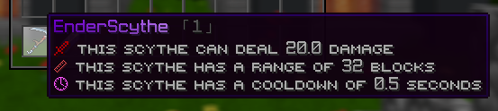
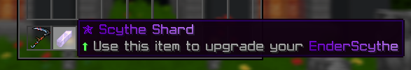

# EnderScythe

**EnderScythe** is a powerful Minecraft plugin that introduces a unique weapon - the Ender Scythe. Players can upgrade this special scythe to netherite while retaining its unique properties. The plugin supports two levels, with configurable damage, cooldown, and range. The scythe cannot be crafted but can be upgraded using a special item.

## Features

- **Custom Weapon:** The Ender Scythe is a unique weapon with special abilities and effects.
- **Particle Effects:** The scythe emits particles around the player, with different effects for each level.
- **Laser Attack:** The scythe can shoot a laser that damages entities within its range.
- **Leveling System:** Players can upgrade the scythe from level 1 to level 2 using a special item.
- **PvP Control:** Configurable option to allow or disallow the scythe's use in player vs. player combat.
- **Upgrade Compatibility:** The scythe can be converted to netherite in the smithing table while retaining its special attributes.
- **Enchanting Restrictions:** The scythe cannot be enchanted or combined in anvils, grindstones, or crafting tables.

## Configuration

The plugin is highly configurable through the `config.yml` and `messages.yml` files.

### config.yml

```yaml
#########################################################################################################
#    Keep in mind that this plugin does not fully support HEX color codes. (#FF0000)                    #
#    You can use https://www.birdflop.com/resources/rgb/ to create your colors                          #
#    You can use old format [§x§r§r§g§g§b§b] or simply follow the pattern that's already used           #
#    Developer; padrewin                                                                                #
#    GitHub; https://github.com/padrewin                                                                #
#    Links: https://linktr.ee/padrewin || https://discord.mc-1st.ro                                     #
#########################################################################################################

# Plugin Prefix:
plugin-prefix: "&8「§x§6§F§0§0§C§DE§x§7§6§0§B§D§0n§x§7§C§1§6§D§3d§x§8§3§2§1§D§6e§x§8§A§2§C§D§9r§x§9§1§3§7§D§DS§x§9§7§4§2§E§0c§x§9§E§4§D§E§3y§x§A§5§5§8§E§6t§x§A§B§6§3§E§9h§x§B§2§6§E§E§Ce」&7» "

# Scythe Shard - item to upgrade your Scythe:
upgrade-item:
  name: "§x§6§F§0§0§C§D✯ §x§6§F§0§0§C§DS§x§7§5§0§A§D§0c§x§7§B§1§4§D§3y§x§8§1§1§E§D§5t§x§8§7§2§8§D§8h§x§8§D§3§2§D§Be §x§9§A§4§6§E§1S§x§A§0§5§0§E§4h§x§A§6§5§A§E§6a§x§A§C§6§4§E§9r§x§B§2§6§E§E§Cd"
  lore:
    - "§a⬆ §7Use this item to upgrade your §x§6§F§0§0§C§DE§x§7§6§0§B§D§0n§x§7§C§1§6§D§3d§x§8§3§2§1§D§6e§x§8§A§2§C§D§9r§x§9§1§3§7§D§DS§x§9§7§4§2§E§0c§x§9§E§4§D§E§3y§x§A§5§5§8§E§6t§x§A§B§6§3§E§9h§x§B§2§6§E§E§Ce§"

# EnderScythe settings:
damage-players: false # Set to true if you want players to use this Scythe in PvP
enderscythe-damage: 20 # damage
enderscythe-cooldown: 500 # milliseconds || this means 0.5 seconds
enderscythe-range: 32

# Activate or deactivate your Scythe's particles in case your players are bothered by that:
ender-scythe-level1-particles: true
ender-scythe-level2-particles: true

# Set world where EnderScythe can be used:
# if you don't put your world here, scythe won't work
enderscythe-use-worlds:
  - overworld
  - enter
  - your
  - world names

# EnderScythe display settings:
ender-scythe:
  name: "§x§6§F§0§0§C§DE§x§7§6§0§B§D§0n§x§7§C§1§6§D§3d§x§8§3§2§1§D§6e§x§8§A§2§C§D§9r§x§9§1§3§7§D§DS§x§9§7§4§2§E§0c§x§9§E§4§D§E§3y§x§A§5§5§8§E§6t§x§A§B§6§3§E§9h§x§B§2§6§E§E§Ce"
  level: "§8「%scythe_level%§8」" # Don't ever change this placeholder except its color. Colors are safe to be edited. Same applies for below lore section
  lore:
    - "§4🗡 §7This scythe can deal %enderscythe_damage% damage"
    - "§c📏 §7This scythe has a range of %enderscythe_range% blocks"
    - "§d🕓 §7This scythe has a cooldown of %enderscythe_cooldown% seconds"
  lore-placeholders:
    - "%enderscythe_damage%"
    - "%enderscythe_range%"
    - "%enderscythe_cooldown%"
  laser-color: "#800080" # Laser hex color (#800080) this is default PURPLE
```

### messages.yml

```yaml
messages:
  receive-hoe: "§7You have received an §x§6§F§0§0§C§DE§x§7§6§0§B§D§0n§x§7§C§1§6§D§3d§x§8§3§2§1§D§6e§x§8§A§2§C§D§9r§x§9§1§3§7§D§DS§x§9§7§4§2§E§0c§x§9§E§4§D§E§3y§x§A§5§5§8§E§6t§x§A§B§6§3§E§9h§x§B§2§6§E§E§Ce§7!"
  config-reloaded: "§7Config reloaded."
  give-success: "§7Successfully given an §x§6§F§0§0§C§DE§x§7§6§0§B§D§0n§x§7§C§1§6§D§3d§x§8§3§2§1§D§6e§x§8§A§2§C§D§9r§x§9§1§3§7§D§DS§x§9§7§4§2§E§0c§x§9§E§4§D§E§3y§x§A§5§5§8§E§6t§x§A§B§6§3§E§9h§x§B§2§6§E§E§Ce §7to {player}."
  player-not-found: "§7Player not found."
  invalid-command: "&cInvalid command."
  upgrade-success: "§7Ender Scythe upgraded to level {level}."
  not-allowed-world: "§7You cannot use the Ender Scythe in this world."
  not-ender-scythe: "§7This is not an §x§6§F§0§0§C§DE§x§7§6§0§B§D§0n§x§7§C§1§6§D§3d§x§8§3§2§1§D§6e§x§8§A§2§C§D§9r§x§9§1§3§7§D§DS§x§9§7§4§2§E§0c§x§9§E§4§D§E§3y§x§A§5§5§8§E§6t§x§A§B§6§3§E§9h§x§B§2§6§E§E§Ce§7."
  receive-upgrade-item: "§7You have received an upgrade item!"
  max-level-reached: "§7This §x§6§F§0§0§C§DE§x§7§6§0§B§D§0n§x§7§C§1§6§D§3d§x§8§3§2§1§D§6e§x§8§A§2§C§D§9r§x§9§1§3§7§D§DS§x§9§7§4§2§E§0c§x§9§E§4§D§E§3y§x§A§5§5§8§E§6t§x§A§B§6§3§E§9h§x§B§2§6§E§E§Ce §fis at §dlevel max§7."
```

## Commands
- **/enderscythe reload:** Reload the plugin configuration.
- **/enderscythe give <name>:** Give a player an Ender Scythe.
- **/getupgradeitem:** Command to receive the upgrade item.

## Permissions
- **enderscythe.admin:** Gives you total power.

## Installation
1. Download the latest release of the plugin.
2. Place the plugin JAR file into your server's plugins directory.
3. Restart your server to load the plugin.
4. Customize the plugin settings in config.yml and messages.yml as needed. || p.s; use /enderscythe reload :P
5. Use the provided commands to receive and upgrade the Ender Scythe.






<blockquote class="imgur-embed-pub" lang="en" data-id="L1K91Wr" data-context="false" ><a href="//imgur.com/L1K91Wr"></a></blockquote><script async src="//s.imgur.com/min/embed.js" charset="utf-8"></script>